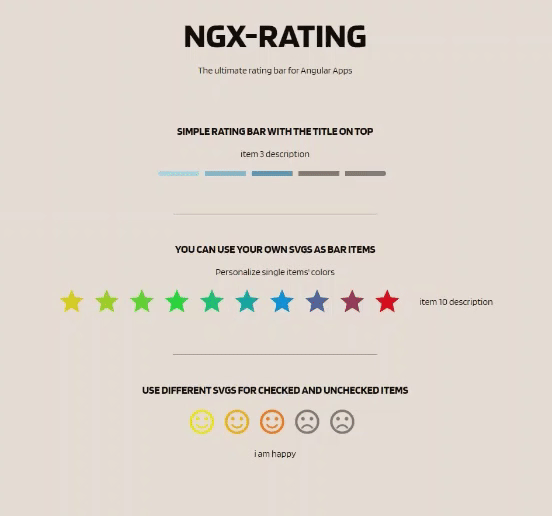

# **ngx-rating**

#### The ultimate rating bar library for Angular & Ionic

This component is built having in mind flexibility and simplicity, our goal is to let yourself having the rating bar you want with no effort.
It is fully usable with Angular & Ionic Reactive Forms, so it's easy to track user actions and modify displayed value at runtime.

<!--  -->

Run this command to install:
```
npm i @aesys/ngx-rating
```

## Usage

To set up your rating bar, just give it a settings Object and an Angular FormControl

```
<ngx-rating
  [settings]="mySettings"
  [formControl]="myFormControl"
></ngx-rating>
```

### Settings Object

| Field name    | Mandatory | Format     |
| :----:        | :----:    | :----:     |
| items         | yes       | Item[]     |
| theme         | yes       | string     |
| itemDetail    | yes       | ItemDetail |
| images        | no        | string[]   |
| showTitle     | yes       | boolean    |
| titlePosition | no        | string     |
| itemMargin    | no        | string     |

Here is an example of a simple Settings Object:

```javascript
let mysettings = {
  items: [
    {
      id: 1,
      description: 'ITEM 1 DESCRIPTION',
      color: {
        red: 180,
        green: 230,
        blue: 245
      }
    },
    {
      id: 2,
      description: 'ITEM 2 DESCRIPTION'
    },
    {
      id: 3,
      description: 'ITEM 3 DESCRIPTION',
    },
    {
      id: 4,
      description: 'ITEM 4 DESCRIPTION',
    },
    {
      id: 5,
      description: 'ITEM 5 DESCRIPTION',
      color: {
        red: 0,
        green: 90,
        blue: 141
      }
    },
  ],
  theme: 'rounded_squares',
  itemDetail: {
    width: 70,
    height: 8
  },
  showTitle: true,
  titlePosition: 'top'
}
```

In the next example, you can see how to set up a rating bar with multiple_icons theme:

```javascript
let mySettings = {
  items: [
    {
      id: 1,
      description: 'I AM NOT HAPPY',
      color: {
        red: 255,
        green: 246,
        blue: 7
      }
    },
    {
      id: 2,
      description: 'I AM NORMAL'
    },
    {
      id: 3,
      description: 'I AM HAPPY',
    },
    {
      id: 4,
      description: 'I AM VERY HAPPY',
    },
    {
      id: 5,
      description: 'I AM REALLY HAPPY',
      color: {
        red: 255,
        green: 7,
        blue: 36
      }
    },
  ],
  theme: 'multiple_icons',
  images: ['../assets/happy.svg', '../assets/sad.svg'],
  itemDetail: {
    width: 50,
    height: 50
  },
  showTitle: true,
  titlePosition: 'bottom',
  itemMargin: '50'
}
```

### Displayed Items format

Items displayed on the bar must have this fields: 

```
{
  id: number,
  description: string,
  color?: {
    red: number,
    green: number,
    blue: number
  }
}
```

### Color Management

Bar items' color is set up based on the color field of the single item.
If the first item only has the color field and last item doesn't, the bar items would all have that color setted.
If multiple items have the color field, the color of the other items would be calculated based on existing ones.

**If first item color field is missing, the bar would be entirely RED and an error will be displayed on console**

### Themes

- squares

- rounded_squares:

    <!--  -->

- single_icon:

    <!--  -->

    When choosing Single Icon theme, you have to fill images field with an array containing local path of the SVG image you want to display.

- multiple_icons:

    <!--  -->
    
    When choosing Multiple Icons theme, you have to fill images field with an array containing local paths of SVG images you want to display.
    First one has to be the one used for selected items, second one for unselected items.  

### Item Detail

Bar items dimensions has to be declared in itemDetail field.
Fill it with an object of this type:

```
{
  width: number,
  height: number
}
```

Dimensions are declared in pixels.

### Item Margin

You can decide how the distance between items should be.
If the field is not in the settings Object, the distance between items would be 10px.
If you choose 'auto', the distance between the items would be the maximum distance possible within the parent component.
If the field is filled with a string containing an Integer, that value would be the distance in pixels between the items.

### Title Management

You may want to display single item description where the item is selected or the user is hovering on it.
showTitle field is mandatory and used to declare if item title has to be shown or not.
titlePosition field is not mandatory, defines the position of item title compared to rating bar.
titlePosition options are:
- top (standard option)
- left
- right
- bottom


## How is made

This library is made out of a single Angular component, extending ControlValueAccessor interface.
Core logic is built around 2 main couple of variables:

- actualSelection/showSelection

  actualSelection stores the index of selected item, gets changed when the user clicks on an item.
  showSelection stores the index of the item currently displayed, the last one selected. It changes when mouse passes over an item and when it leaves it.

- actualDescription/showDescription

  logic is similar to previous one, actualDescription stores the description of the selected item and changes whe the user clicks, showDescription hosts currently shown description and changes when mouse hovers items.

ControlValueAccessor interface provides functions to get data to parent component using Angular ReactiveForms.

### Color generation

Items colors are stored in `color` local variable.
When the component is initialized, `getColorScale` function (located in color-generator.ts) is called. It gets color for items that are missing the color field calculating the average color between previous and next item that have color field filled.

If last item is missing the color field, all items' color will be overwritten with color from the first item.
If first item is missing the color field, all items'color will be overwritten with red and an error message will be displayed on console.

### Title position

Title position is managed directly into HTML using flex-direction property and adding margin based on needings.

---

##### Author:

  Giovanni Della Pelle

  Nora Vallo

  Manuel Midiri
